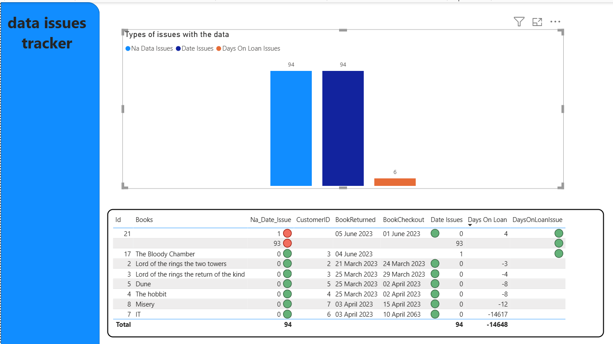

# QA_module5

## Brief:
The library wants their data that has been given to us in a CSV file cleaned and made available to them in an interactive dashboard so they can track books on loan currently.

## The Requirements:
### Must have:
- Clean and validate the data
- Have the process organised into a replicable script
- A batch process set up

### Should have
- Function based code that can be unit tested

### Could have
- An internal engineering dashboard showing metrics about daily runs etc

### Won't have
- A containerised solution at this moment in time 

## What has been achieved so far:

### Create Architecture diagram and Project plan/Kanban Board
The architecture diagram was created in a group environment, it was kept on Joseph's GitHub but has now been added to the **Architecture files** in this QA MODULE5 repo

### Create a method to clean the data 
This has been created in the **data_clean_script.py** file, this has gone through a few iterations and now contains a MVP of the script to clean the data. this will need a little more work to get production ready but has had light cleaning and been enriched with an aggregated column to show the amount of days a book has been on loan

### Create a method to unit test data 
This has been created in the **unit_testing_data_clean_script.py** file

### Created a containerised Docker file
This has been created in the **Docker_data_clean** folder. this is for testing purposes currently but can be implemented later should the product need to be shipped to another system and all its dependencies be kept intact

## Final day project
on the final day we were tasked with refactoring the clean script so that it could be used to run a diagnostic dashboard. this would show the data that had been quarantined.

at this point I decided to split the **system_book** data into two data frames the original but cleaned, and a dataframe containing the quarantined issues. 
This was then output to a power Bi dashboard and the bad data visualised using a simple graph for each type of data issue. A table was added with counts of the issues and conditional formatting to add colour that easily identified the row issues

